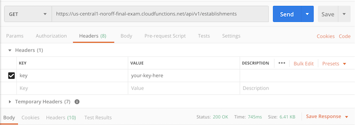
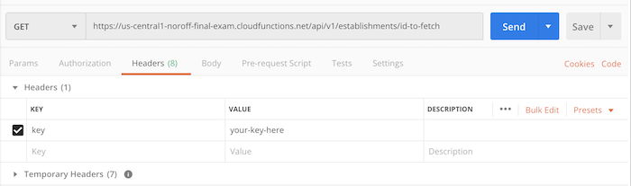
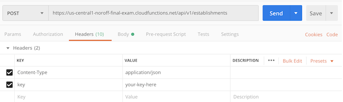
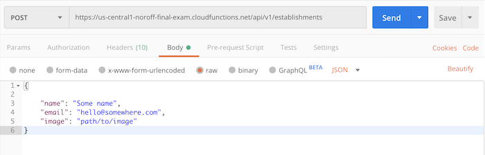
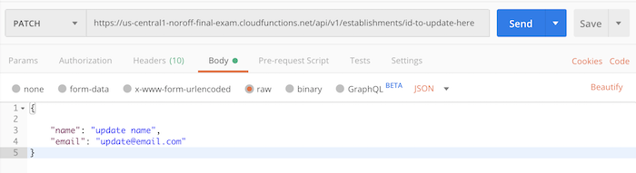
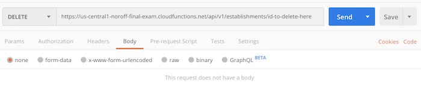

# HOLIDAZE - HOTEL BOOKING SITE

## Hosted API version

Base URL
```js
https://us-central1-noroff-final-exam.cloudfunctions.net/api/v1/
```

You will need to add a key called `key` with your access key as its value to the header of every request to the API.

We will also add a content type to the header, though this is not necessary for `GET` and `DELETE` calls.

You can add header values using the second parameter of the fetch call.

### Constants

`src/constants.js`:
```js
const KEY = "your-key";
const BASE_URL = "https://us-central1-noroff-final-exam.cloudfunctions.net/api/";
const FETCH_OPTIONS = {
    headers: {
        "Content-Type": "application/json",
        key: KEY,
    },
};
```

## Establishments

Establishments have the following properties:

```ts
name: string
email?: string
image?: string
price?: number
maxGuests?: number
lat?: number
lng?: number
description?: string
address?: string
selfCatering?: boolean
```

`?` means a property is optional. Only `name` is required.

Import these for every call:

```js
import { BASE_URL, FETCH_OPTIONS } from "../path/to/constants";
```

### Fetch all establishments - a `GET` request

`GET` is the default request mode.

```js
const url = BASE_URL + "establishments";

fetch(url, FETCH_OPTIONS).then(r => r.json()).then(j => console.log(j));
```

In Postman. 

> Every request needs the `key` set in Headers.



---

### Fetch one establishment - a `GET` request

```js
const id = "id-of-establishment"

const url = BASE_URL + "establishments/" + id;

fetch(url, FETCH_OPTIONS).then(r => r.json()).then(j => console.log(j))
```

In Postman.



---

### Create an establishment - a `POST` request

```js
const url = BASE_URL + "establishments";

// the data we want to send
const newEstablishment = {
    "name": "A hotel name",
    "email": "someone@email.com",
    "image": "path/to/image",
    // ...other properties
};

// when creating an establishment we need to use the POST method
FETCH_OPTIONS.method = "POST";

// serialise the data
FETCH_OPTIONS.body = JSON.stringify(newEstablishment);

// send every
fetch(url, FETCH_OPTIONS)
    .then((r) => r.json())
    .then((j) => console.log(j));

```

In Postman.

Headers.



Body.



---

### Update an establishment - a `PATCH` request

```js
const id = "id-of-establishment-to-update";

const url = BASE_URL + "establishments/" + id;

const updatedEstablishment = {
    "name": "Updated name",
    "email": "updated@email.com",    
    // ...other properties
};

FETCH_OPTIONS.method = "PATCH";

FETCH_OPTIONS.body = JSON.stringify(updatedEstablishment);

fetch(url, FETCH_OPTIONS)
    .then((r) => r.json())
    .then((j) => console.log(j));
```

Postman headers - same as POST request.

Body:



---

### Delete an establishment - a `DELETE` request

```js
const id = "id-of-establishment-to-delete";
const url = BASE_URL + "establishments/" + id;

FETCH_OPTIONS.method = "DELETE";

fetch(url, FETCH_OPTIONS)
```

Postman headers - same as GET request.

Body:



---

## Enquiries

Enquiries have the following properties:

```ts
name: string
email: string
establishmentId: string
checkIn: Date
checkOut: Date
```

### Fetch all enquiries

```js
const url = BASE_URL + "enquiries";

fetch(url, FETCH_OPTIONS).then(r => r.json()).then(j => console.log(j))
```

---

### Fetch one enquiry

```js
const id = "an-id-to-fetch";
const url = BASE_URL + "enquiries/" + id;

fetch(url, FETCH_OPTIONS).then(r => r.json()).then(j => console.log(j))
```

---

### Create an enquiry

```js
const url = BASE_URL + "enquiries";

// the data we want to send
const data = {
    "name": "Bob The Sheep",
    "email": "bob@sheepstuff.no",
    "establishmentId": "an-id",
    "checkIn": "May 28 2020",
    "checkOut": "May 29 2020"
};

FETCH_OPTIONS.method = "POST";

FETCH_OPTIONS.body = JSON.stringify(data);

// send every
fetch(url, FETCH_OPTIONS)
    .then((r) => r.json())
    .then((j) => console.log(j));
```

---

### Delete an enquiry

```js
const id = "id-of-enquiry-to-delete";
const url = BASE_URL + "enquiries/" + id;

FETCH_OPTIONS.method = "DELETE";

fetch(url, FETCH_OPTIONS)
```

---

> There is no PATCH method for enquiries

---

## Contact messages

Contact messages have the following properties:

```ts
name: string
email: string
message: string
```


### Fetch all contacts

```js
const url = BASE_URL + "contacts";

fetch(url, FETCH_OPTIONS).then(r => r.json()).then(j => console.log(j))
```

---

### Fetch one contact

```js
const id = "an-id-to-fetch";
const url = BASE_URL + "contacts/" + id;

fetch(url, FETCH_OPTIONS).then(r => r.json()).then(j => console.log(j))
```

---

### Create a contact

```js
const url = BASE_URL + "contacts";

const data = {
    "name": "Fred The Cow",
    "email": "fred@cowstuff.no",
    "message": "What's the haps, chaps?",
};

FETCH_OPTIONS.method = "POST";
FETCH_OPTIONS.body = JSON.stringify(data);

fetch(url, FETCH_OPTIONS)
    .then((r) => r.json())
    .then((j) => console.log(j));
```

---

### Delete an contact

```js
const id = "id-of-contact-to-delete";
const url = BASE_URL + "contacts/" + id;

FETCH_OPTIONS.method = "DELETE";

fetch(url, FETCH_OPTIONS)
```

---

> There is no PATCH method for contacts

---

---

## PHP localhost version

A very basic scaffolding using PHP has been created for you to use.

## Installation

In order to get the PHP code to work you need to run it on a server. You could use your web host, but that would be quite cumbersome to work on. To make it easier to code, download XAMPP https://www.apachefriends.org/index.html (or another development environment) and install it. This allows you to run a server on your computer.

Once installed, open the panel and click 'Start' on Apache to start your local server. Now find where XAMPP has been installed on your computer (on Windows it's likely to be C:\xampp\) and once in this folder open 'htdocs'. Take the unzipped folder 'hotel-booking', which this README is inside of, and copy-paste the whole folder into the htdocs folder.

Now open your browser and go to http://localhost/hotel-booking/contact.html. There you should see a simple contact form. This means the files are correctly running on your local server.

If you run into any problems, please let your tutor know.

#### Repository

The provided HTML files are a way to test sending data to the server endpoints, but you can't send data to the server in a React or Vue project that way. Examples of posting data in the frontend frameworks will be provided.

-   the contact form should send data to http://localhost/hotel-api/contact-success.php
-   the enquiry form should send data to http://localhost/hotel-api/enquiry-success.php
-   the add establishment form should send data to http://localhost/hotel-api/add-establishments-success.php

Store your JSON files inside your frontend project's public folder, and ensure that your PHP files are reading and writing to these files. The section you need to update with the correct filepath is file_get_contents('establishments.json') and file_put_contents('establishments.json', \$jsonData); as these are what are writing and reading your JSON files.

You can fetch the contents of the json files by using the following URLs:

-   http://localhost/hotel-api/get-establishments.php
-   http://localhost/hotel-api/get-establishment.php
-   http://localhost/hotel-api/get-enquiries.php
-   http://localhost/hotel-api/get-contacts.php

## The Code

#### HTML

The names of the inputs in the provided HTML forms are the ones that must be used. The PHP codes is expecting those names.

#### PHP

The PHP code used is fairly simple and has been tested and works correctly. In most projects you'd use a database to store and retrieve data, but to make things easier for you we have created PHP to generate JSON files for you to access. This means that when a user on the front-end sends a contact message, this gets handled by PHP and the data added to a JSON file with an array of contact messages.

#### JSON

The reason we have chosen to create JSON files for you, is that you are likely to find this the most simple way of handling the data on the front-end. One thing to note is that the way the PHP has been written it requires a minimum of one entry in the JSON files, so please don't delete all records in the JSON file.

## Pages

For this project it's important to understand the two views of the website. The first is from the customer-facing side where they can view establishments, make enquiries and send contact messages. These enquiries and messages all get handled from an admin area. This admin area allows an administrator to view the enquiries and messages, and create a new establishment to view on the customer-facing side.

#### Contact

The contact page is for visitors to the site to message the admin team at Holidaze. The page has three inputs for full name, email address and message. The customer submits the form, which gets processed on a separate page, and the data gets added to a JSON file.

#### Enquiry

The enquiry page is the same as above, except with more inputs. One important thing to note on this page is that the name of the establishment has been hard-coded to the page into the value of the input. You need to change the value of the input based on which establishment the user is on. This data then gets sent via the form to the admin area where they can see the name of the establishment being enquired for.

#### Add Establishments

This page is on the admin area and allows the administrators to create a new establishment. When the form is submitted, the data is added to the establishments.json file.
