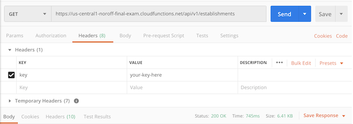

## Hosted API version

A skeleton React project which includes calls to the API can be found [here](https://github.com/javascript-repositories/hotel-api-example-site).

Base URL
```js
https://us-central1-noroff-final-exam.cloudfunctions.net/api/v1/
```

You will need to add a key called `key` with your access key as its value to the header of every request to the API.

We will also add a content type to the header, though this is not necessary for `GET` and `DELETE` calls.

You can add header values using the second parameter of the fetch call.

### Constants

`src/constants.js`:
```js
const KEY = "your-key";
const BASE_URL = "https://us-central1-noroff-final-exam.cloudfunctions.net/api/";
const FETCH_OPTIONS = {
    headers: {
        "Content-Type": "application/json",
        key: KEY,
    },
};
```

## Establishments

Establishments have the following properties:

```ts
name: string
email?: string
image?: string
price?: number
maxGuests?: number
lat?: number
lng?: number
description?: string
address?: string
selfCatering?: boolean
```

`?` means a property is optional. Only `name` is required.

Import these for every call:

```js
import { BASE_URL, FETCH_OPTIONS } from "../path/to/constants";
```

### Fetch all establishments - a `GET` request

`GET` is the default request mode.

```js
const url = BASE_URL + "establishments";

fetch(url, FETCH_OPTIONS).then(r => r.json()).then(j => console.log(j));
```

In Postman. 

> Every request needs the `key` set in Headers.



---

### Fetch one establishment - a `GET` request

```js
const id = "id-of-establishment"

const url = BASE_URL + "establishments/" + id;

fetch(url, FETCH_OPTIONS).then(r => r.json()).then(j => console.log(j))
```

In Postman.


---

### Create an establishment - a `POST` request

```js
const url = BASE_URL + "establishments";

// the data we want to send
const newEstablishment = {
    "name": "A hotel name",
    "email": "someone@email.com",
    "image": "path/to/image",
    // ...other properties
};

// when creating an establishment we need to use the POST method
FETCH_OPTIONS.method = "POST";

// serialise the data
FETCH_OPTIONS.body = JSON.stringify(newEstablishment);

// send every
fetch(url, FETCH_OPTIONS)
    .then((r) => r.json())
    .then((j) => console.log(j));

```

In Postman.

Headers.


Body.


---

### Update an establishment - a `PATCH` request

```js
const id = "id-of-establishment-to-update";

const url = BASE_URL + "establishments/" + id;

const updatedEstablishment = {
    "name": "Updated name",
    "email": "updated@email.com",    
    // ...other properties
};

FETCH_OPTIONS.method = "PATCH";

FETCH_OPTIONS.body = JSON.stringify(updatedEstablishment);

fetch(url, FETCH_OPTIONS)
    .then((r) => r.json())
    .then((j) => console.log(j));
```

Postman headers - same as POST request.

Body:


---

### Delete an establishment - a `DELETE` request

```js
const id = "id-of-establishment-to-delete";
const url = BASE_URL + "establishments/" + id;

FETCH_OPTIONS.method = "DELETE";

fetch(url, FETCH_OPTIONS)
```

Postman headers - same as GET request.

Body:


---

## Enquiries

Enquiries have the following properties:

```ts
name: string
email: string
establishmentId: string
checkIn: Date
checkOut: Date
```

### Fetch all enquiries

```js
const url = BASE_URL + "enquiries";

fetch(url, FETCH_OPTIONS).then(r => r.json()).then(j => console.log(j))
```

---

### Fetch one enquiry

```js
const id = "an-id-to-fetch";
const url = BASE_URL + "enquiries/" + id;

fetch(url, FETCH_OPTIONS).then(r => r.json()).then(j => console.log(j))
```

---

### Create an enquiry

```js
const url = BASE_URL + "enquiries";

// the data we want to send
const data = {
    "name": "Bob The Sheep",
    "email": "bob@sheepstuff.no",
    "establishmentId": "an-id",
    "checkIn": "May 28 2020",
    "checkOut": "May 29 2020"
};

FETCH_OPTIONS.method = "POST";

FETCH_OPTIONS.body = JSON.stringify(data);

// send every
fetch(url, FETCH_OPTIONS)
    .then((r) => r.json())
    .then((j) => console.log(j));
```

---

### Delete an enquiry

```js
const id = "id-of-enquiry-to-delete";
const url = BASE_URL + "enquiries/" + id;

FETCH_OPTIONS.method = "DELETE";

fetch(url, FETCH_OPTIONS)
```

---

> There is no PATCH method for enquiries

---

## Contact messages

Contact messages have the following properties:

```ts
name: string
email: string
message: string
```


### Fetch all contacts

```js
const url = BASE_URL + "contacts";

fetch(url, FETCH_OPTIONS).then(r => r.json()).then(j => console.log(j))
```

---

### Fetch one contact

```js
const id = "an-id-to-fetch";
const url = BASE_URL + "contacts/" + id;

fetch(url, FETCH_OPTIONS).then(r => r.json()).then(j => console.log(j))
```

---

### Create a contact

```js
const url = BASE_URL + "contacts";

const data = {
    "name": "Fred The Cow",
    "email": "fred@cowstuff.no",
    "message": "What's the haps, chaps?",
};

FETCH_OPTIONS.method = "POST";
FETCH_OPTIONS.body = JSON.stringify(data);

fetch(url, FETCH_OPTIONS)
    .then((r) => r.json())
    .then((j) => console.log(j));
```

---

### Delete an contact

```js
const id = "id-of-contact-to-delete";
const url = BASE_URL + "contacts/" + id;

FETCH_OPTIONS.method = "DELETE";

fetch(url, FETCH_OPTIONS)
```

---

> There is no PATCH method for contacts

---
